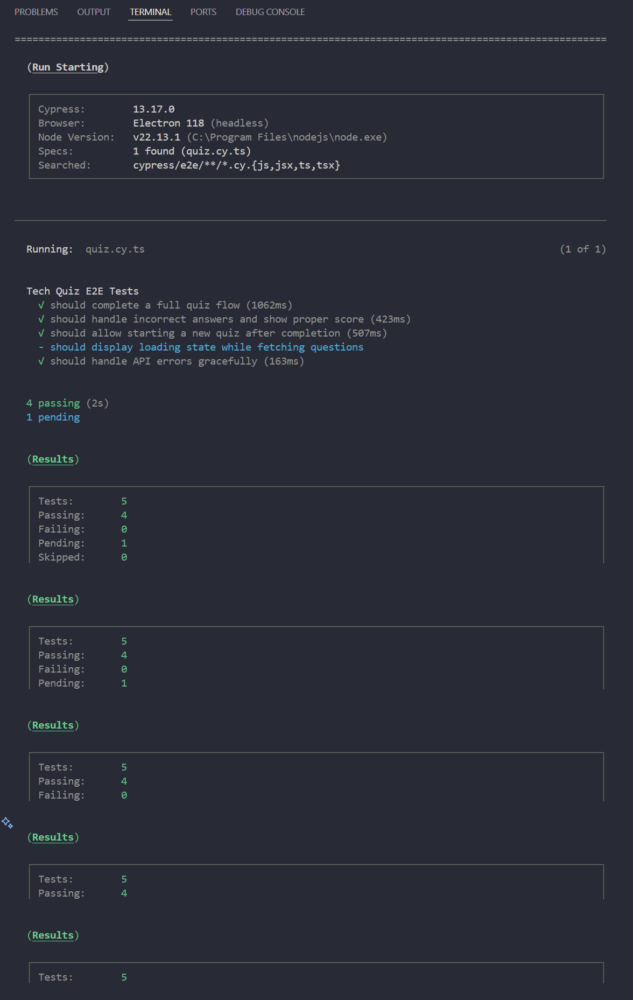
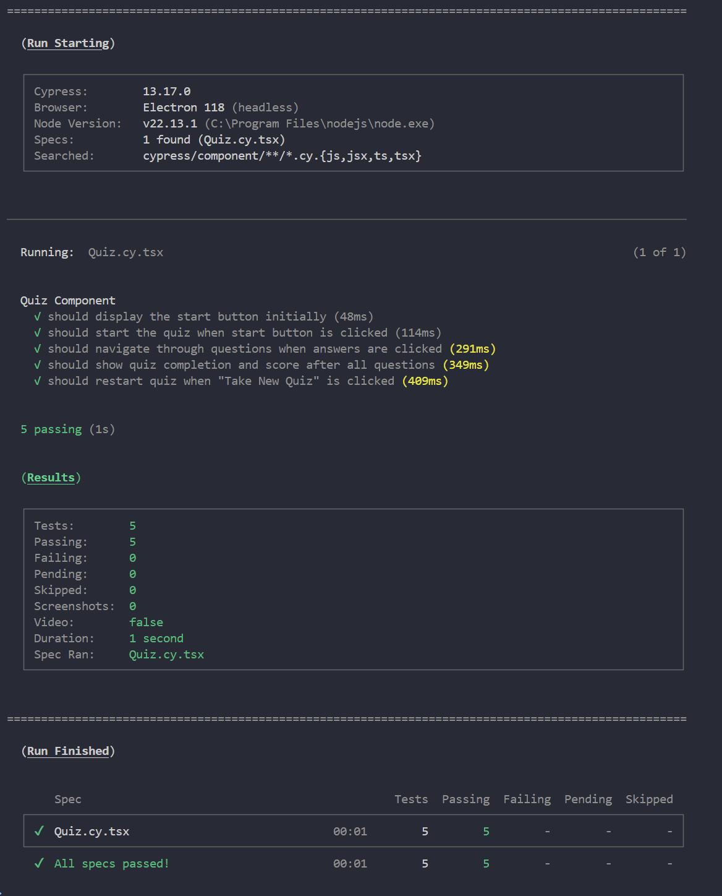
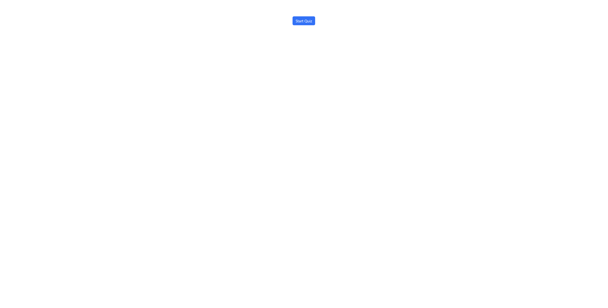
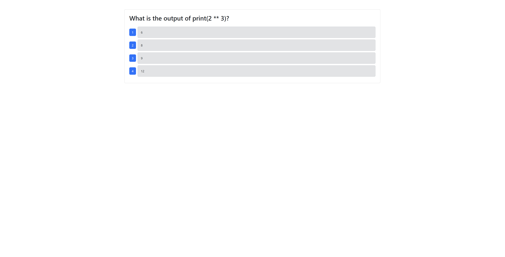
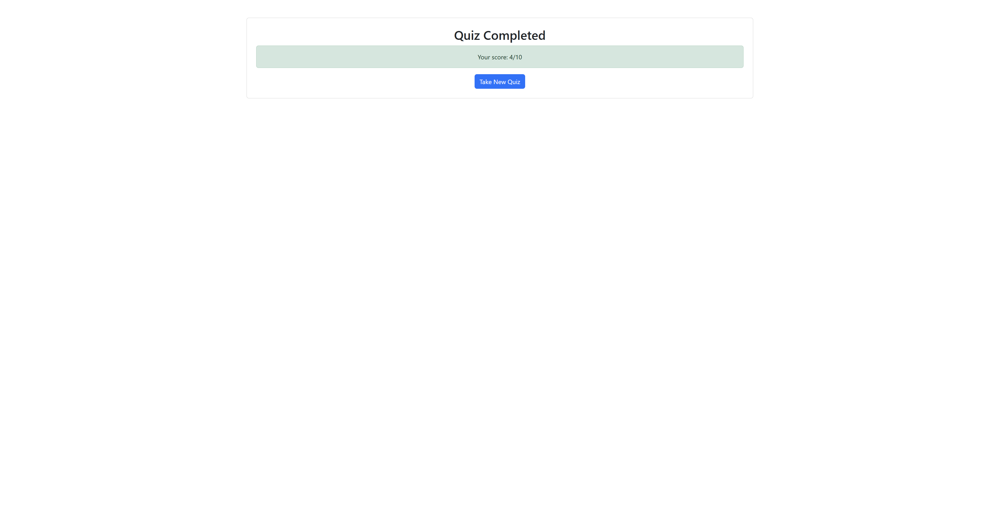

# Tech Quiz Test Suite

## Description

This project enhances a fully functioning Tech Quiz application by adding comprehensive testing using Cypress for both component and end-to-end (E2E) tests. The application was built using the MERN stack with a React front end, MongoDB database, and Node.js/Express.js server and API. Users can take a quiz of ten random questions and view their final score.

The testing suite ensures reliability and robustness through automated testing of all user interactions and component behaviors.

## Table of Contents

- [Installation](#installation)
- [Usage](#usage)
- [Testing](#testing)
- [Features](#features)
- [Technologies Used](#technologies-used)
- [Video Walkthrough](#video-walkthrough)
- [Screenshots](#screenshots)
- [License](#license)
- [Contributing](#contributing)
- [Questions](#questions)

## Installation

1. Clone the repository:

   ```bash
   git clone https://github.com/yourusername/tech-quiz-testing-suite.git
   cd tech-quiz-testing-suite
   ```

2. Navigate to the project directory:

   ```bash
   cd 02-Challenge/Develop
   ```

3. Install dependencies:

   ```bash
   npm install
   ```

4. Set up environment variables:

   ```bash
   cd server
   cp .env.EXAMPLE .env
   cd ..
   ```

5. Ensure MongoDB is running on your system

6. Seed the database:

   ```bash
   npm run seed
   ```

## Usage

1. Start the application:

   ```bash
   npm run start:dev
   ```

2. Open your browser and navigate to:

   ```bash
   http://localhost:3001
   ```

3. Click "Start Quiz" to begin the tech quiz

## Testing

### Run All Tests

```bash
npm run test
```

### Run E2E Tests Only

```bash
npm run test:e2e
```

### Run Component Tests Only

```bash
npm run test:component
```

### Open Cypress UI

```bash
npm run cypress:open
```

### Test Results

- **E2E Tests**: 4 passing (1 skipped)
- **Component Tests**: 5 passing
- **Total**: 9 tests successfully validating all acceptance criteria

## Features

### Application Features

- Start a tech quiz with randomized questions
- Navigate through multiple-choice questions
- Track score throughout the quiz
- View final score upon completion
- Start a new quiz after finishing

### Testing Features

- **E2E Tests** (`cypress/e2e/quiz.cy.ts`):

  - Complete quiz flow from start to finish
  - Incorrect answer handling and scoring
  - Quiz restart functionality
  - API error handling

- **Component Tests** (`cypress/component/Quiz.cy.tsx`):
  - Initial component rendering
  - Quiz initialization
  - Question navigation
  - Score calculation
  - Component state management

## Technologies Used

- **Frontend**: React 18, TypeScript, Bootstrap
- **Backend**: Node.js, Express.js
- **Database**: MongoDB, Mongoose
- **Testing**: Cypress 13.17.0, @testing-library/cypress
- **Build Tools**: Vite, TypeScript
- **Deployment**: Render (application), YouTube (demo video)

## Video Walkthrough

🎥 **[View Video Demo](https://youtu.be/-41qE_M4qqc)**

The video demonstration shows:

- Running tests from the command line

- All E2E and component tests passing

- Live application functionality

- Project structure and test files

## Screenshots

### Testing Summary


_E2E tests showing 4 passing tests_


_Component tests showing 5 passing tests_

### Application


_Initial quiz interface with Start Quiz button_


_Quiz in progress showing a question with multiple choice answers_


_Quiz completion screen showing final score_

## License

This project is licensed under the MIT License - see the [LICENSE](LICENSE) file for details.

## Contributing

This was a solo project for Columbia University Coding Bootcamp. While this repository is primarily for educational assessment, feedback and suggestions are welcome.

## Questions

For questions about this project, please contact:

- GitHub: [jadenszewczak](https://github.com/jadenszewczak)
- Email: <jaden.szewczak@wakefern.com>

---

© 2024 Columbia University Coding Bootcamp. Module 19: Testing Challenge.
